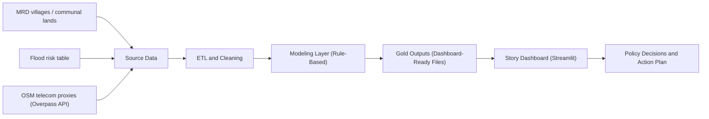
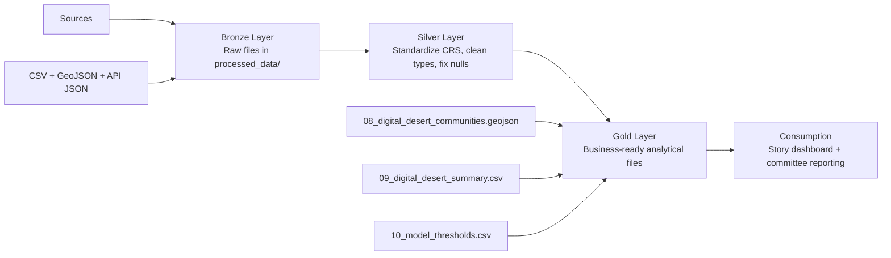
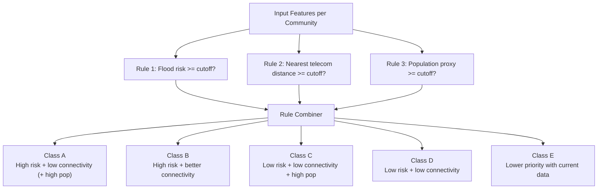
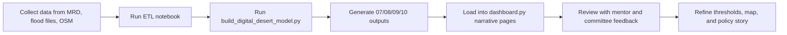

# Architecture and Process Diagrams

Use these Mermaid diagrams in your final report or presentation.

## 1) Solution Architecture (End-to-End)

## 2) ETL Architecture (Bronze / Silver / Gold)

## 3) Modeling Logic Flow (Interpretability First)

## 4) Operational Workflow (How We Did It)

